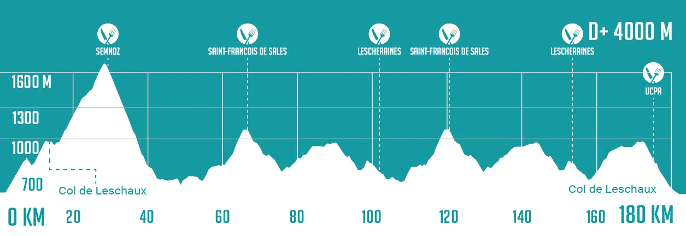
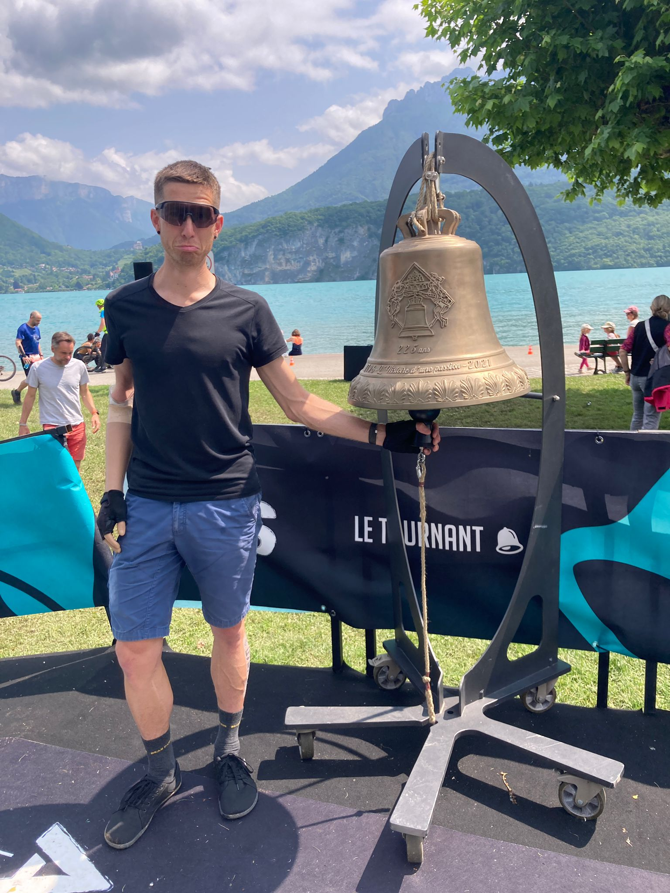

[&#x2B05;](../)

Ironman près d'Annecy avec 3.8 kilomètres de natation dans le lac, 180 kilomètres de vélo avec 4000 mètres de dénivelé positif dans le massif des Bauges puis un marathon trail.

Ce triathlon comporte plusieurs particularités:
- Le départ se fait à 5h30 de nuit depuis le milieu du lac, où un bateau emmène les athlètes.
- Celles et ceux qui arrivent au 25ème kilomètre du marathon avant 12 heures de course ont le privilège de sonner la cloche symbolique et de terminer le marathon en haut du Semnoz (1350 mètres de dénivelé positif sur les 13 derniers kilomètres).

J'ai déja participé à cette course en 2019 et je n'avais pas réussi à sonner la cloche, je reviens donc avec la ferme intention de prendre ma revanche. Mon entraînement s'est bien passé, je suis dans la forme de ma vie. Depuis le début de l'année je me suis entraîné un peu moins de 13 heures par semaine en moyenne. Pour cette préparation j'ai décidé d'être mon propre coach et de gérer mon plan d'entraînement moi-même. Aurais-je été mieux préparé en ayant pris un vrai coach? Peut-être. Aurais-je eu un meilleur niveau en n'étant pas au bar un soir sur deux? Ça ne fait aucun doute. Mais gérer mon entraînement moi-même et garder ma vie sociale fait partie de mon plaisir au quotidien et c'est essentiel pour pouvoir tenir sur la durée. J'aime me lancer des défis mais je ne suis pas prêt à faire tous les sacrifices pour la performance, d'autant plus que le jour J plein de choses peuvent mal se passer. J'arrive à Annecy très confiant sur mes capacités à sonner la cloche mais je suis malgré tout très stressé à cause de la partie vélo, avec des descentes de cols très pentues et sinueuses où l'on prend beaucoup de vitesse. Je suis très joueur mais je ne freine que de l'avant et je n'ai pas vraiment envie de jouer à 1, 2, 3, soleil !

Sur place je retrouve ma soeur Clémence et son copain Charlie, qui font le semi-Ironman le même jour, ainsi que mes parents qui sont venus nous encourager. Comme à chaque fois, les yeux sont rivés sur la météo, qui s'annonce vraiment mauvaise. Les jours passent et l'espoir de voir les prévisions s'améliorer se dissipe peu à peu. La veille de la course le verdict est sans appel: le départ de la course se fera en alerte orange sous des orages avec risque de grêle, puis il pleuvra à grosses gouttes toute la journée. Alors que je suis en train de préparer toutes mes affaires pour le lendemain, je reçois un mail de l'organisation: suite à un arrêté préfectoral, la natation est annulée, et sera remplacée par 5 kilomètres de course à pieds. Le triathlon se transforme donc en duathlon. Grosse déception, mais en même temps je n'ai pas très envie non plus de nager en recevant des des grêlons dans la figure.

3h30 le réveil sonne, je regarde aussitôt par la fenêtre: il pleut des cordes et les nombreux éclairs laissent apercevoir un ciel bien noir. Vraiment aucune autre envie que rester au sec et au chaud sous la couette. Mais nous sommes tous dans le même bateau (en l'occurence non) et le cerveau déterminé ne laisse pas le choix: on y va! Derniers préparatifs pour les transitions au parc à vélo sous des trombes d'eau, avant de se réfugier sous un grand barnum en attendant le départ. Première coupure de courant, puis deuxième. Je me demande comment c'est possible de descendre des cols à vélo dans ces conditions et j'espère secrètement que les organisateurs vont annoncer l'annulation de la course, J'SUIS PAS VENU ICI POUR SOUFFRIR OK?

Alors que je suis assis sur un banc les yeux dans le vide à réfléchir au sens de la vie, j'aperçois un gars avec un micro face à une caméra, et à ma grande surprise je le reconnais, c'est Fabio, un pote d'école d'ingé, ça fait plus de 10 ans qu'on ne s'est pas vus, trop drôle de se retrouver ici. Il se trouve qu'il s'occupe de la couverture live de l'évènement alors forcément j'ai le droit à mon interview. Petit moment de gloire pour mes sandales qui passent sous les feux des projecteurs, mais gloire de courte durée sur BFM TV (pourtant hyper qualitatif n'est-ce-pas) parce que le journaliste qui a vu les images me prend pour un gros touriste et parle d'amuser la galerie.

6h top départ, c'est parti pour 5 kilomètres de course à pied dans des marres d'eau et de la gadoue. Je prends un gros plaisir à voir tous les participants zigzaguer pour éviter les flaques et essayer de ne pas trop mouiller leurs chaussures alors qu'avec mes sandales je ne crains rien et je fais des gros tout droit. Prends ça BFM.

Après une transition express je me lance sur mon vélo. Le parcours démarre par 26.5 kilomètres d'ascension jusqu'au sommet du Semnoz (1350 mètres de dénivelé positif en une montée). Je me sens en jambes et j'appuie bien sur la pédale, mais je ne prends aucun plaisir, il fait de plus en plus froid au fur et à mesure que l'on monte en altitude et il pleut des cordes, j'ai une piscine dans chaque chaussure ça fait flaque flaque à chaque coup de pédale. Je cherche à voir le positif:
- Je n'ai pas chaud.
- Je ne vais pas prendre de coup de soleil.
- Je n'ai froid qu'à une seule main.
- Je peux me tester dans des conditions difficiles et voir ce que j'ai dans le ventre.

Malgré le froid et la pluie je pense à boire et à manger très régulièrement, ce qui est primordial sur une épreuve longue distance de ce genre. Une grosse envie de pipi me prend. Étant donné la pluie incessante, je décide de ne pas arrêter et de faire ça en route, ce qui sera très vite rincé. Mais impossible de réussir à enclencher le truc sans m'arrêter de pédaler, ce que je ne veux pas faire. Après une belle ascension j'arrive au sommet et j'attaque la descente que je redoute tant, toujours sous des trombes d'eau. Je suis hyper prudent et je ne prends aucun risque. Je vois des mecs un peu (beaucoup) cinglés me dépasser comme des fusées, je suis à la fois hyper admiratif mais aussi choqué de la prise de risque, d'autant plus que la course se fait sur route ouverte avec des voitures qui peuvent arriver en face. Je vois des mecs entamer des virages sur la gauche de la route sans même voir si une voiture arrive. Quelques minutes après je vois un premier mec sur la bas côté avec les secours et la couverture de survie, ça calme.

Je m'approche de la fin de la descente et je commence à me relâcher un peu, je réussis enfin à me détendre assez pour réussir à enclencher le pipi, qui coule le long de la jambe tout en roulant. Je suis content, ça y est je suis un vrai cycliste. Dans les secondes qui suivent, la pluie s'arrête, comme de par hasard. Je me marre en pensant à mes potes qui vont m'appeler le pulapisse (cf. la sotizerie). Le soleil fait une timide apparition et fait un bien fou au moral, je me dis que ça y est c'est peut-être le début d'une belle fin de course, mais 20 minutes après la pluie revient de plus belle. Les kilomères défilent, les montées et les descentes s'enchaînent et j'avance bien. Le plat n'existe quasiment pas sur ce parcours:

Pour gérer mon effort je n'ai pas de ceinture cardio et pas de capteur de puissance, je me fie à mon ressenti et je pédale avec le coeur, à la Marc Madiot. Après le 100ème kilomètre, une fois n'est pas coutume, j'ai l'impression de m'être trompé de route, je panique et je fais demi-tour, je réfléchis un peu et je refais demi-tour, indécis. Je suis hyper énervé parce que j'ai fait une bonne prépa, je fais une bonne course et je suis peut-être en train de tout faire foirer parce que je n'ai pas assez étudié le parcours. J'arrête un arbitre qui passe et je lui explique, il me dit que non c'est bon tout va bien. Je suis refait, je repars de plus belle.

Je fais un arrêt d'une minute trente au ravito du kilomètre 115 pour refaire le plein de boisson et de nourriture. Ce sera mon seul arrêt des 180 kilomètres. Je passe le 140ème kilomètre et je regarde ma vitesse moyenne: je suis au-dessus de mes prévisions les plus optimistes, et ce malgré les conditions météorologiques très mauvaises, je suis hyper ravi, cela me donne de la force pour continuer et maintenir l'effort jusqu'au bout, ce qui me fera moins de 7h30 pour la partie vélo. Même si je suis large niveau chrono pour la cloche (une heure d'avance), je prévois de partir à 4'30/kilomètre pour le marathon (mon point fort) pour voir si ça passe.

Alors que je suis dans une énième descente, j'aperçois dans le virage au loin ce qui semble être un homme qui agite des drapeaux, je ralentis. Lorsque je me rapproche il crie pour me dire de m'arrêter. Je le dépasse et j'aperçois un énorme bouchon de vélos sur plusieurs centaines de mètres, et tout devant plusieurs camions de pompier et voitures de la gendarmerie, je me demande ce qui se passe. En discutant avec les autres athlètes, le bouche à oreilles ayant produit son effet, j'apprends qu'il y a eu un accident. Puis j'apprends que l'accident est grave. Puis j'apprends que l'hélicoptère est venu et est reparti. Puis j'apprends qu'il y a carrément eu un décès. Clémence et Charlie étant également sur la course (nous avons une partie du parcours en commun), je suis mort d'inquiétude. J'emprunte le téléphone d'un autre athlète et j'appelle mon père pour savoir s'il a eu des news, il me répond que non. Il n'était pas au courant de l'accident. Me voilà bloqué au mileu de nulle part, en sachant qu'un.e participant.e s'est pris un camion et est décédé.e et en ne sachant pas de qui il s'agit. Je broie du noir, j'imagine le pire. L'attente est interminable. Après une éternité (peut-être 10 minutes), le gars à qui j'ai emprunté le téléphone reçoit un SMS de mon père disant qu'il a eu Clémence et qu'elle va bien. Elle a aussi emprunté le téléphone de quelqu'un d'autre et téléphoné en pleurs à mon père pour savoir s'il avait des news de Charlie et moi. Me voilà à moitié rassuré mais je suis toujours hyper inquiet car j'ai déjà vu Charlie à l'oeuvre dans les descentes et je sais qu'il bombarde. Le bouche à oreille continuant de produire son effet, j'apprends que le participant décédé était classé troisième sur ma course, je suis soulagé (information qui s'avèrera fausse mais qui aura au moins permis de me rassurer), bien que je sois hyper affecté par le fait qu'une personne faisant la même course que moi ait perdu la vie à quelques centaines de mètres devant. Les organisateurs passent parmi nous et nous annoncent l'interruption de la course, tout le monde est prié de regagner le parc à vélo en file indienne sans se doubler et de rentrer chez soi. Le retour est interminable, 35 kilomètres de montagne sous des trombes d'eau, dans une ambiance très morose. Petit craquage émotionnel après toutes ces émotions fortes.

Lorsque nous arrivons au parc à vélo, tous les spectateurs nous applaudissent de part et d'autre de la route, dans le silence, c'est très émouvant, nouvelles petites larmes. Je suis forcément déçu de ne pas pu avoir pu sonner la cloche après m'être tant investi, mais je suis vivant, Clémence et Charlie aussi, pas de chute, tout va bien, et c'est plus important que tout le reste. Je suis malgré tout content de ma performance, lorsque la course s'est arrêtée j'étais classé 76ème (RPZ) et je pense que j'aurais pu intégrer le top 50 après le marathon. Prochain rendez-vous le 12 Juillet pour l'Altriman, autre Ironman, dans les Pyrénées cette fois.

&#x1F3A5; [Mon petit interview sur le live de l'évènement (à 27'30)](https://www.youtube.com/live/SYaekFDgyYQ?feature=shared&t=1650) &#x1F3A5;

&#x1F3A5; [Journaliste qui se moque de mes sandales sur BFM TV](https://www.bfmtv.com/lyon/replay-emissions/lyon-week-end/alpsman-2025-coup-d-envoi-du-triathlon-de-l-extreme-dans-des-conditions-tres-difficiles_VN-202506070058.html) &#x1F3A5;

&#x1F4CA; [Plan d'entraînement](https://docs.google.com/spreadsheets/d/1SL7n9KRl1pf3mZ0Z-TOyNe4-zLDoP7c0dyobJLIEWjw/) &#x1F4CA;

&#x1F30E; [Site web de l'épreuve](https://alps-man.com/evenements/alpsman/epreuves/xtrem-triathlon/) &#x1F30E;

&#x23F1; [Résultats](https://lvorganisation.com/alpsman2025/#1_C4DB2B) &#x23F1;

