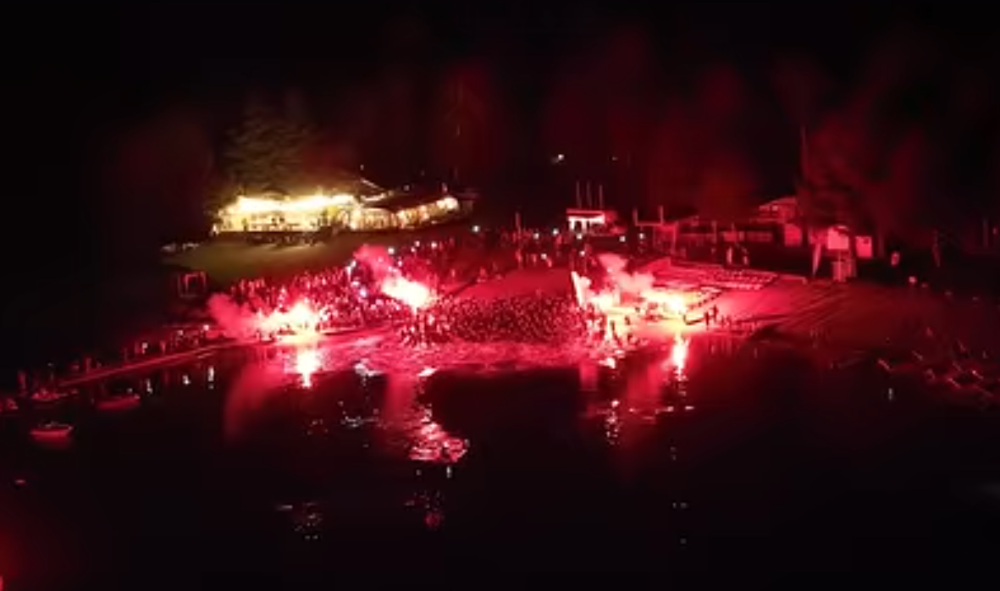

[&#x2B05;](../)

L'Altriman est un triathlon parmi les plus durs du monde dans les Pyrénées avec au programme :
- 3.8 kilomètres de natation dans un lac à 1550 mètres d'altitude ;
- 194 kilomètres de vélo avec 5000 mètres de dénivelé positif ;
- 42 kilomètres de trail avec 1100 mètres de dénivelé positif.

Lorsque j'arrive sur place une semaine avant je ne me sens pas très motivé, je n'ai pas encore récupéré mentalement de l'[Alpsman](./2025_06_07_Alpsman.md), je n'ai pas la niaque. Mais après avoir fait un bout du parcours vélo, un bout du parcours course à pied et après avoir nagé dans le lac, je commence à me projeter et à avoir hâte. Pour cette course je ne me mets aucune pression au niveau du chrono, mon seul objectif est de prendre un maximum de plaisir et de profiter des paysages magnifiques tout au long de la journée.

La veille du départ, cela devient une habitude, les organisateurs nous annoncent lors du briefing que pour des raisons de sécurité le parcours vélo et le marathon seront peut-être raccourcis à cause des orages violents qui sont annoncés, avec notamment une "forte activité électrique". L'info sera donnée à 4h15 le lendemain matin.

Réveil 3h30 après une poignée d'heures de sommeil, le stress éloignant les bras de Morphée. Je me prépare pour partir au lac et le verdict tombe : le parcours vélo est rétréci pour ne faire plus que 102 kilomères et 2130 mètres de dénivelé positif, le but étant que tout le monde ait terminé le vélo quand l'orage arrive. Le marathon quant à lui est maintenu dans sa globabilé pour le moment mais cela pourra évoluer en fonction des conditions météorologiques. Je suis déçu parce que je me suis entraîné dur pour réaliser 2 Ironmans extrêmes et au final je ne vais en faire aucun en entier, mais c'est le jeu lorsque l'on pratique un sport d'extérieur, qui plus est en montagne. L'avantage c'est que je serai plus vite à l'apéro le soir.

5h30 pétantes top départ pour la natation dans le lac, de nuit avec pour seules lumières des fumigènes, comme à la Beaujoire.

Comme à chaque fois c'est le bordel, tout le monde se nage dessus et se tabasse, plaisir d'offrir et de recevoir. Je fais très attention à ne pas prendre un coup dans la figure pour ne pas casser mes lunettes, ce qui serait une catastrophe. Le parcours se compose de 2 boucles où l'on traverse le lac. Il fait nuit noire et juste avant le départ le speaker nous informe que nous devons viser la lumière de l'autre côté du lac car on ne voit pas du tout la bouée autour de laquelle nous devons faire demi-tour. Après m'être sorti du troupeau je lève la tête pour m'orienter et j'aperçois 4 lumières bien distinctes de l'autre côté, OK merci Didier. J'en choisis une au hasard et je me prends plein de nageurs, visiblement ce n'est pas la bonne, j'en choisis une autre, cette fois ça a l'air d'être bon, me voilà lancé. Le soleil se lève sur les montagnes pendant que je nage, c'est un vrai régal. Je sors de l'eau après 1h06.

Les paysages du parcours vélo sont magnifiques avec des routes à flanc de montagne offrant une vue dégagée sur la vallée. En plus de ça le soleil est au rendez-vous et caresse la peau, je suis en extase et quand je passe à côté de quelqu'un je ne peux m'empêcher de lâcher un petit commentaire : "oua c'est tellement beau c'est fou", "oh coucou Carquefou moi aussi j'suis du 44", j'ai l'impression d'être bourré sur mon vélo &#128514; Les kilomètres défilent et il fait beau et chaud, c'est à se demander pourquoi la course a été rétrécie. Je pose le vélo après 4h11 de pédalage, un peu déçu de ne pas avoir vu une seule pancarte "Allez Alain Philippe" sur le bord de la route.

J'enfile mes sandales préférées et je me lance pour le marathon trail, composé de 2 boucles. Le ciel se couvre et on entend du tonnerre au loin mais pour le moment pas de pluie, il fait même très chaud. Nous commençons direct par 13 kilomètres de montée, pas l'temps de niaiser ! Une bonne partie du parcours est en forêt sur des chemins avec de la caillasse, c'est très beau et très sauvage. Je papote avec d'autres participants, tout le monde est très sympa, cela permet de penser à autre chose que la douleur qui se fait de plus en plus sentir dans les jambes. Je double un concurrent qui me dit que ça ne se fait pas de doubler quelqu'un avec des tongs, je le regarde en souriant et je me rends compte qu'il est très sérieux et même un peu énervé. Un peu moins sympa celui-là.

Peu après que je me sois lancé sur la deuxième boucle la pluie se joint à la fête. Les éclairs deviennent de plus en plus fréquents et ont l'air de se rapprocher. La pluie se transforme en déluge. Je rattrape 2 autres coureurs, l'un me dit qu'il flippe et qu'il hésite à abandonner, en tant que normand je suis étonné et je ne comprends pas trop pourquoi, ce n'est que de l'eau et nous ne sommes pas en sucre. Nous continuons à courir tous les 3 et au final je me mets sérieusement à flipper moi aussi, les éclairs font un boucan pas possible et semblent de plus en plus proches. Nous commençons à compter les secondes entre la lumière de l'éclair et son son pour estimer la distance, sachant que 3 secondes équivalent à un kilomètre. Nouvel éclair, 1, 2, 3, 4, 5, bon ça va, ils sont assez loin. Les trombes d'eau se transforment en grêlons, ça fouette et ça fait mal (je suis peut-être un peu en sucre finalement), nous nous réfugions sous un arbre pour attendre que ça passe. Je commence à être frigorifié, la température a chuté, je suis trempé et je suis immobile. Nouvel éclair, 1, grosse détonation, punaise, c'est tout près. Nous décidons de repartir, et là, c'est le drame ! Ça se met à péter de partout, devant, derrière, à gauche, à droite, c'est apocalyptique, si bien qu'un éclair tombe à 30 mètres sur un arbre près de nous, j'ai l'impression de pouvoir le toucher. Nous voilà donc à poil au milieu d'un orage de montagne. Je suis terrorisé, pour la première fois de ma vie j'ai peur de mourir. Je veux abandonner mais ce n'est pas possible, nous sommes paumés sur des chemins de trail et nous devons rentrer par nos propres moyens. Le plaisir du matin au soleil est bien loin. Nous discutons de la meilleure chose à faire, rester planté au milieu des éclairs ou courir à travers, il semble qu'il n'y ait pas de bonne solution. Nous décidons de foncer tête baissée et nous partons en courant, cela permettra au moins de se réchauffer un peu. Nous essayons de rester un maximum abrités sous les arbres (certains me diront par la suite que c'est tout l'inverse qu'il fallait faire). Le chemin se transforme en petit torrent qui descend sur nous et l'eau nous arrive maintenant jusqu'aux chevilles. Nous apercevons une sorte de cabane au loin et nous décidons de faire un détour pour aller nous y réfugier sous une couverture de survie et appeler le numéro d'urgence situé sur notre dossard. Alors que l'on commence à composer le numéro la pluie s'arrête et nous voyons d'autres participants passer sur le chemin, nous décidons de repartir. Je suis en hypothermie, je me sens tout étourdi et lorsqu'on me parle je ne comprends pas très bien ce que l'on me raconte, je suis à la ramasse. Un mec super sympa me passe son k-way pour que je me réchauffe un peu, puis le reprend parce qu'il commence à être frigorifié lui aussi. Il me donne alors sa couverture de survie, je m'enroule dedans et je cours les 10 derniers kilomètres du marathon comme cela. Je vois des voitures passer avec des participants à l'intérieur.

Je franchis la ligne d'arrivée après 10h45 de course et 5h15 pour le marathon, soulagé. Le speaker me demande si j'ai fait tout le marathon en sandales et me dit devant toute la salle d'aller consulter quand je lui réponds que oui. J'apprendrai par la suite que pas longtemps après moi les organisateurs de la course ont interdit aux participant.e.s de se lancer pour leur deuxième boucle pour des raisons de sécurité. Je termine 89ème. Sur les 300 participant.e.s nous sommes seulement 127 à avoir pu courir les 2 boucles du marathon.

&#x1F3A5; [Départ de la natation de nuit](https ://www.instagram.com/altrimanofficiel/reel/DMDmWWkofW5/) &#x1F3A5;

&#x1F30E; [Site web de l'épreuve](https://www.altriman.com/courses/altriman/) &#x1F30E;

&#x23F1; [Résultats](http://www.altriman.com/wp-content/uploads/2025/07/Resultats-Full-Altriman_2025.pdf) &#x23F1;

&#x1F4CA; [Plan d'entraînement](https://docs.google.com/spreadsheets/d/1SL7n9KRl1pf3mZ0Z-TOyNe4-zLDoP7c0dyobJLIEWjw/) &#x1F4CA;
